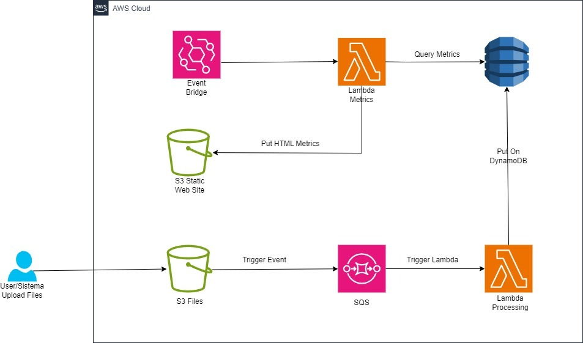

# Projeto Terraform para Processamento de Eventos na AWS

## Descrição
Este projeto Terraform configura uma arquitetura na AWS para processamento automatizado de eventos de arquivo em um bucket S3, utilizando SQS, Lambda, DynamoDB e Event Bridge.

## Arquitetura
A arquitetura do projeto consiste em componentes interconectados que facilitam a coleta, processamento e monitoramento de eventos de arquivos armazenados no S3. Abaixo está o diagrama da arquitetura:

## Componentes

### AWS S3
- **Bucket de Dados:** Recebe arquivos e dispara eventos para o SQS.
- **Bucket Estático:** Hospeda uma página estática que exibe as métricas processadas.

### AWS SQS
- **Fila de Eventos:** Recebe eventos de criação de objetos do bucket S3 e os encaminha para a função Lambda de processamento.

### AWS Lambda
- **lbda-processing-sqs:** Processa eventos da fila SQS e atualiza a tabela DynamoDB com contagens de tipos de arquivo.
- **lbda-metrics:** Executada a cada 20 minutos para ler a tabela DynamoDB e atualizar as métricas no CloudWatch e na página estática S3.

### AWS DynamoDB
- **Tabela FileCounts:** Armazena contagens de tipos de arquivos processados.

### AWS Event Bridge
- Monitora as métricas e dispara alarmes se necessário.

## Código Terraform
O código Terraform está organizado em vários arquivos para melhor manutenção e compreensão:

- `main.tf`: Define os recursos principais como S3, SQS, Lambda e DynamoDB.
- `iam.tf`: Contém as definições de políticas e roles IAM para os serviços AWS.
- `variables.tf`: Declara as variáveis usadas no projeto.
- `outputs.tf`: Define os outputs do Terraform.
- `terraform.tfvars`: Contém os valores das variáveis para ambientes específicos.

## Uso
Para utilizar este projeto, você deve inicializar o Terraform com `terraform init`, revisar as mudanças planejadas com `terraform plan` e aplicar as mudanças com `terraform apply`. Certifique-se de ter configurado suas credenciais AWS.
